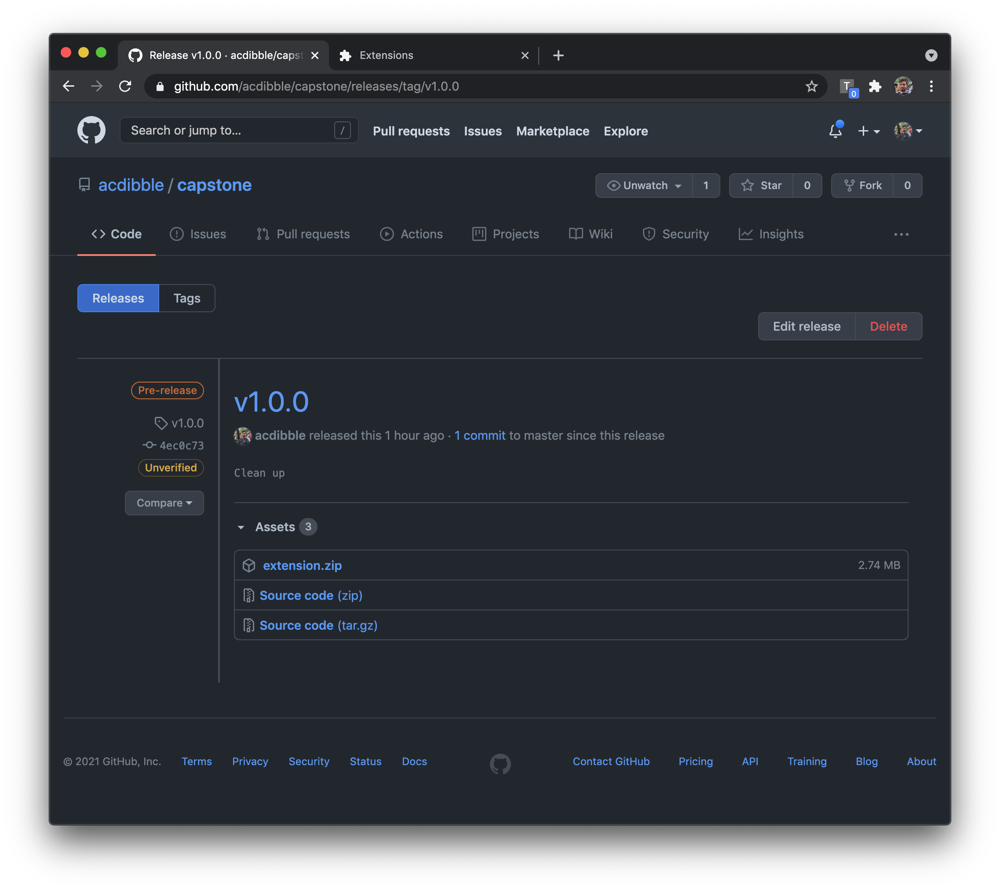
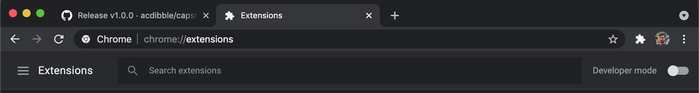
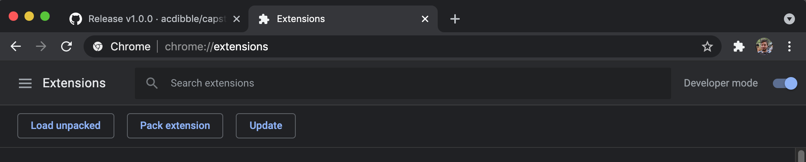
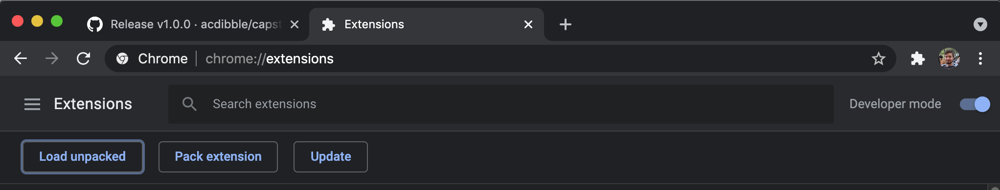
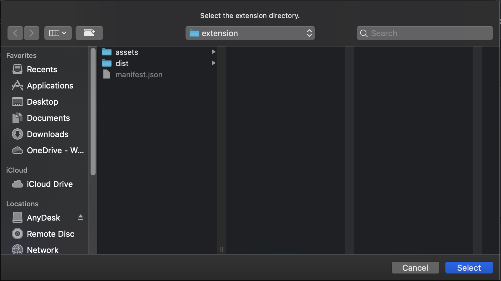
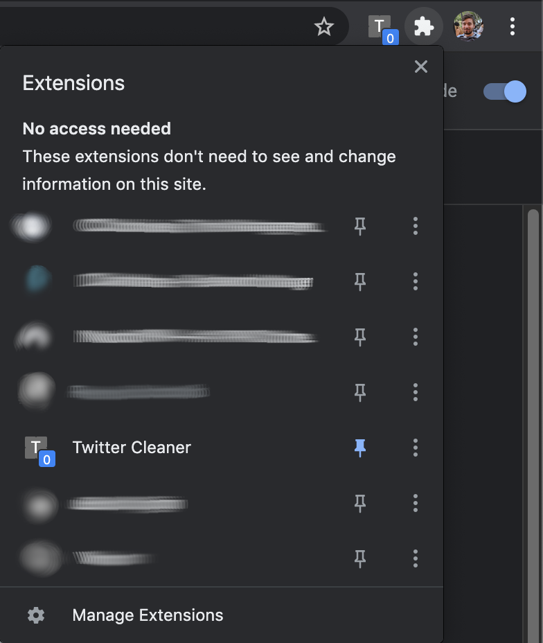
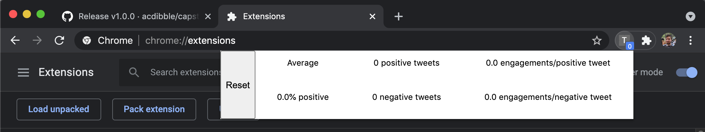

# capstone

### Installation

1. Be viewing this document in Chrome web browser
2. Go to [releases](https://github.com/acdibble/capstone/releases/)
3. Download
[extension.zip](https://github.com/acdibble/capstone/releases/download/v1.0.0/extension.zip)

3. Unzip file in your directory of choice
4. Navigate to [`chrome://extensions`](chrome://extensions)

6. Toggle developer mode on

7. Click `Load unpacked`

8. Select the directory which contains the unzipped contents of `extension.zip`

9. Pin the extension

10. Click on the icon to view the statistics dashboard

### Usage

Browse Twitter as normal. Check the dashboard for statistics on the filtering of
tweets. Press the reset button to reset the statistics and store of filtered
tweets.
